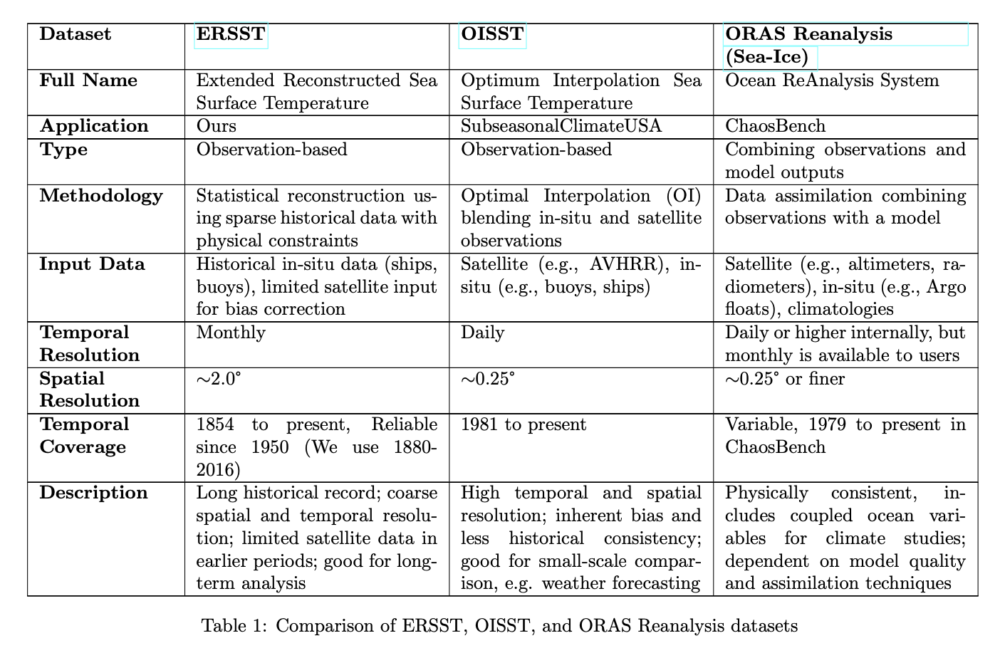

# sst-data-analysis

## Goals

The overarching goal of this project is to use sea surface temperature data to predict seasonal rainfall in the US. [Current work:](https://github.com/hwalters361/ML_rain_prediction/tree/vivit-work)

As a part of this goal, we should analyzing different sources of sea surface temperature try to visualize the differences.

### Source one: Extended Reconstructed Sea Surface Temperature (ERSST)

This is the dataset that is currently being used in our 3DViT pipeline to try and forecast rainfall.

[ERSST](https://www.ncei.noaa.gov/products/extended-reconstructed-sst)

### Source two: OISST

[OISST](https://www.ecmwf.int/en/research/climate-reanalysis/ocean-reanalysis)

### Source two: ChaosBench 

[ChaosBench](https://leap-stc.github.io/ChaosBench/dataset.html)

